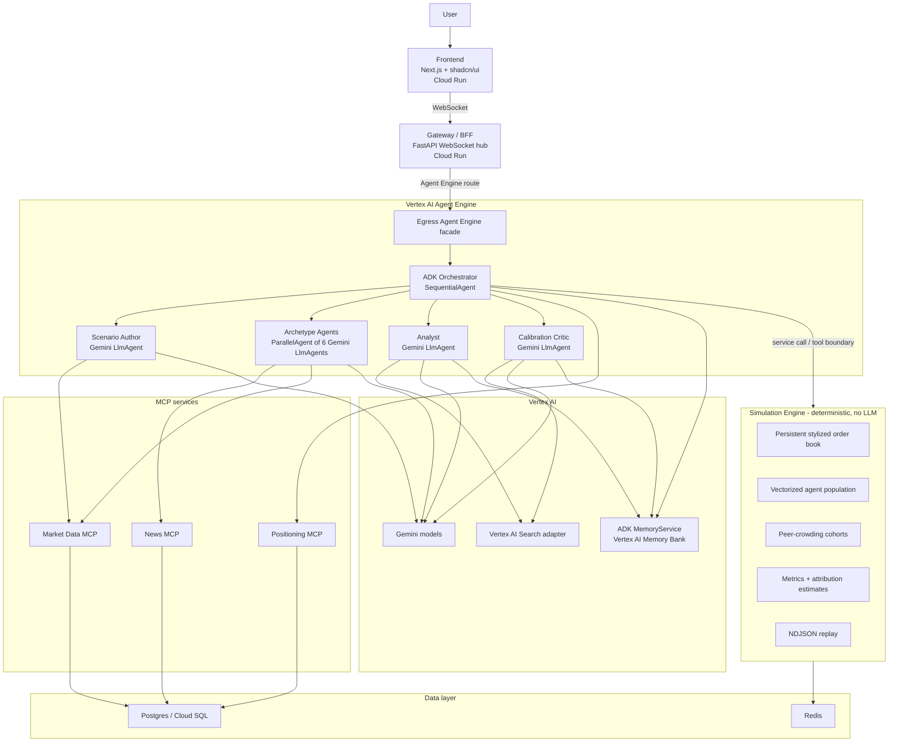

# Egress AI - Architecture and Build Guide

This file is the working guide for coding agents in this repository. It should
describe the product as it exists now, not an aspirational diagram. The repo and
package name is `egress`; the product name is Egress AI.

Read this before changing code. Keep future edits candid about what is observed,
what is simulated, and what is still an approximation.

---

## 1. Product Promise

Egress simulates how an investment position could behave during a crisis exit
before capital is committed. A user describes a position and stress event in
plain language. Egress turns that into a scenario, builds a simulated crowd of
market participants, runs their orders through a deterministic order-book
engine, and reports whether the position clears, how far the simulated price
moves while selling, and how much remains stuck.

This is an assumption-based stress simulator, not a trading forecast and not a
claim of exact causal attribution. It uses real and free data where available
(daily OHLCV, news headlines, public positioning evidence), then clearly labels
synthetic or curated assumptions when free sources cannot support a stronger
claim.

### The core design rule

Gemini is one part of the system, not the market engine. Gemini/ADK is used for
scenario interpretation, mood/stance assumptions, analysis, and calibration
narrative. The order book, price formation, tick loop, population actions,
metrics, replay, and ensemble bands are deterministic Python code. Do not put a
Gemini call inside the per-agent or per-tick loop.

The system must continue to run in a deterministic baseline mode with zero model
calls. That is both the cost-control path and the proof that the model tunes and
explains assumptions rather than being the engine.

---

## 2. Current Deployed Shape

The current public demo URL is:

```text
https://egress-frontend-978090004115.us-central1.run.app
```

The deployed path uses:

- Cloud Run for the frontend, gateway, deterministic engine service, and MCP
  services.
- Vertex AI Agent Engine for the ADK orchestrator facade.
- Gemini via Vertex AI only. AI Studio API keys are not used.
- Three MCP services: market data, news, and positioning.
- Redis for deployed engine/run-state storage.
- Postgres/Cloud SQL for cached market/news/positioning responses and local data
  support.
- ADK `VertexAiMemoryBankService` / Vertex AI Memory Bank when an Agent Engine
  resource id is configured.
- A local corpus retriever with a Vertex AI Search adapter for RAG grounding.
- Agent cards for A2A-style discovery metadata.

Full A2A transport is not mandatory for Track 1 and is not the critical runtime
dependency here. The gateway currently routes live Gemini runs through the
deployed Agent Engine facade, while local development can call the in-process ADK
driver. Agent cards live under `docs/agent-cards/`.

The gateway defaults to a fast live Gemini strategy for user latency: Gemini
builds scenario assumptions once, then the deterministic low/base/high ensemble
runs. The slower detailed ADK path with per-window archetype stance refresh still
exists for CLI/demo use and for `EGRESS_GEMINI_LIVE_MODE=detailed`.

---

## 3. System Architecture



The SVG diagrams in `docs/egress-architecture.svg` and
`docs/egress-run-flow.svg` are the user-facing versions of this architecture.
Keep them visually consistent with this file and with `README.md`.

---

## 4. ADK Agent Design

The agent layer is built around a real ADK `SequentialAgent` lifecycle. The
detailed tree is:

```text
EgressRun (SequentialAgent)
+-- ScenarioAuthor      LlmAgent  -> scenario_config        (live detailed path)
+-- SetupEngine         BaseAgent -> market_state, replay_ref
+-- SimulateLoop        LoopAgent
|   +-- Archetypes      ParallelAgent of 6 LlmAgents -> *_stance (live detailed)
|   |   +-- baseline    BaselineStancesAgent -> same stance keys, no LLM
|   +-- AdvanceEngine   BaseAgent -> engine.advance(...)
+-- FinalizeEngine      BaseAgent -> run_metrics, replay_ref
+-- LoadMemoryContext   BaseAgent -> memory_context
+-- Analyst             LlmAgent or baseline template
+-- CalibrationCritic   LlmAgent or baseline critic (when enabled)
+-- PersistMemory       BaseAgent -> scenario/calibration memory
```

ADK patterns used explicitly: `SequentialAgent`, `LoopAgent`, `ParallelAgent`,
sessions/state, callbacks, MCP tools as ADK `FunctionTool`s, generator-critic
calibration, and deterministic guardrails around model outputs. The installed ADK
may emit deprecation warnings for workflow agents; the repo accepts those
warnings because the rubric values visible ADK orchestration.

### Fast live path

The gateway's normal user-facing live Gemini path is fast mode:

1. Build/validate a deterministic `RunConfig` from UI levers and evidence.
2. Call the Gemini Scenario Author once through Vertex AI (through Agent Engine
   in deployed mode, or the local ADK runner in local live mode).
3. Merge the model's scenario assumptions into the validated config.
4. Run the deterministic low/base/high ensemble.
5. Stream replay frames, metrics, bands, timing, and analysis to the frontend.

If the Gemini assumption step times out or errors, the gateway returns the
deterministic ensemble rather than failing the run. The timing report records
the fallback.

### Detailed live path

The detailed path still runs the six Gemini archetype agents as a
`ParallelAgent`, one per investor type:

- forced seller
- panic seller
- trend follower
- bargain hunter
- market maker
- long-term holder

Each writes to a distinct `*_stance` key so the fan-out does not race on shared
state. Stances are refreshed once per simulation window, never per individual
agent and never per tick.

The model-facing stance schema is permissive where needed, and callbacks or
contract validation clamp outputs into the engine's `Stance` ranges before the
deterministic engine reads them.

### Baseline path

Baseline mode swaps model agents for deterministic stand-ins and still runs the
same lifecycle boundary. It is used by tests, local demos, and cost-free
development. Do not break it.

---

## 5. Deterministic Engine

The deterministic core lives under `engine/` and contains no LLM calls.

What is implemented:

- A stylized price-time-priority order book in `engine/orderbook/book.py`.
- Resting orders that persist across ticks, age, cancel, and replenish based on
  stress.
- A vectorized NumPy population with staggered holdings, limits, triggers, and
  peer-crowding cohorts.
- Exogenous shock scheduling from the scenario.
- A fixed single-stock volatility-halt rule.
- Matched-fill metrics: fill rate, slippage, implementation shortfall, drawdown,
  stuck percentage, time to exit, VWAP, and halt state.
- Heuristic attribution and paired counterfactual estimates where configured.
- NDJSON record/replay streams.
- Low/base/high ensemble runs for decision-grade bands instead of one point
  estimate.

Important caveat: this is a simulated order book built from agents and ADV-scaled
liquidity. It is not observed Level 2 exchange depth, a prime-broker feed, or a
paid all-holder positioning feed. Price moves come from matched simulated orders
plus scheduled exogenous shock gaps.

---

## 6. MCP Services and Data

There are three MCP services.

### Market Data MCP

`mcp/market_data` exposes daily OHLCV/reference tools. With
`ALPHAVANTAGE_API_KEY` set, it calls Alpha Vantage `TIME_SERIES_DAILY` and caches
responses. Without a key, or when throttled, it returns deterministic synthetic
data labelled as such.

Free-tier daily bars provide recent conditions, not full historical crisis
windows. Cached mode replays committed historical recordings; live mode uses the
instrument's current available daily data.

### News MCP

`mcp/news` exposes event-news and sentiment tools. With an Alpha Vantage key, it
uses `NEWS_SENTIMENT`; otherwise it uses deterministic synthetic crisis tape and
lexicon sentiment.

### Positioning MCP

`mcp/positioning` supplies free peer-crowding evidence. Source precedence is:

1. User-uploaded holdings CSV.
2. Opt-in SEC EDGAR public JSON (`EGRESS_ENABLE_SEC_EDGAR=true` and a descriptive
   `SEC_USER_AGENT`).
3. Curated public crisis fixtures.
4. Deterministic synthetic assumptions.

SEC evidence is useful but conservative. It does not become a paid-grade
all-holder aggregation feed, and the product must label the evidence source and
confidence.

The agents currently use in-process ADK `FunctionTool` wrappers for these tools.
The `server.py` files are the Cloud Run MCP service surfaces and support
streamable HTTP when deployed.

---

## 7. RAG and Memory

RAG grounding is implemented through `rag/retriever.py`: a local curated corpus
path plus a Vertex AI Search adapter when `VERTEX_SEARCH_DATASTORE_ID` and
related env vars are configured. The analyst and critic include source-labelled
retrieved snippets in their prompts. The simulation log and deterministic metrics
remain the source of truth.

Long-term memory is implemented behind `memory/store.py`.

- In deployed/Vertex mode, Egress uses ADK's `VertexAiMemoryBankService`, scoped
  by `EGRESS_MEMORY_AGENT_ENGINE_ID` or `EGRESS_AGENT_ENGINE_ID`.
- Local/offline paths use JSONL or Postgres through the same memory facade.
- Scenario history and calibration records are both represented.

Do not confuse long-term memory with ADK `session.state`. `session.state` is the
short-term state for one run; Memory Bank is cross-run memory.

---

## 8. Frontend

The frontend lives under `web/` and is a Next.js/Tailwind/shadcn app. It should
remain a usable product surface, not a marketing page.

Expected surfaces:

- Scenario builder with plain-language stress text.
- Position size, exit speed, crowding, time-scale, and peer-evidence controls.
- Cached/live mode and real-Gemini toggle.
- Price/replay visualization and order-book depth.
- Metrics, bands, stuck amount, halt state, and impact attribution.
- Analyst explanation and evidence labels.
- Scenario history/reopen surfaces where supported by memory/backend data.

After significant frontend changes, run `npm run build` in `web/` and inspect the
local app in the browser when feasible.

---

## 9. Repository Map

```text
egress/
+-- agents/                  # ADK agents, Agent Engine facade, remote client
+-- engine/                  # deterministic simulation core; no LLM calls
+-- mcp/
|   +-- market_data/         # Alpha Vantage daily/reference tools
|   +-- news/                # Alpha Vantage news/sentiment tools
|   +-- positioning/         # user CSV, SEC EDGAR, curated, synthetic evidence
+-- memory/                  # ADK MemoryService / Memory Bank facade
+-- rag/                     # local corpus retriever + Vertex AI Search adapter
+-- gateway/                 # FastAPI WebSocket hub and API routes
+-- web/                     # Next.js frontend
+-- docs/                    # architecture, contracts, platform, eval docs, replays
+-- eval/                    # backtest, holdout, latency, corpus evals
+-- scripts/                 # auth check, replay recording, deployed smoke, DB init
+-- tests/                   # offline-runnable unit/integration tests
+-- cloudbuild.*.yaml        # backend service image builds
+-- web/cloudbuild.yaml      # frontend image build
+-- docker-compose.yml       # local Postgres + Redis and service topology comments
+-- Dockerfile               # multi-target backend image
+-- Makefile
+-- pyproject.toml
+-- README.md
+-- AGENTS.md
```

`infra/` currently contains placeholders rather than complete cloud
infrastructure-as-code. Long-lived GCP resources are documented in
`docs/platform.md` and prepared as a manual/platform bootstrap step; normal app
deploys should not silently create costly resources.

---

## 10. Deployment and CI/CD

Pushes to `main` are deployed by `.github/workflows/deploy.yml`. The workflow
updates existing Cloud Run services and the existing Agent Engine resource. The
frontend service name must not change, because the public judging URL depends on
it.

Cloud Build configs:

- `cloudbuild.engine.yaml`
- `cloudbuild.gateway.yaml`
- `cloudbuild.market-data-mcp.yaml`
- `cloudbuild.news-mcp.yaml`
- `cloudbuild.positioning-mcp.yaml`
- `web/cloudbuild.yaml`

The deployment order is backend services first, then Agent Engine, then gateway,
then frontend. The deployed smoke script checks the public frontend, gateway
health, cached replay, WebSocket cached/live runs, authenticated engine health,
and MCP endpoint reachability.

Local development can run without GCP credentials. Live Gemini requires:

```bash
gcloud auth application-default login
make auth-check
```

---

## 11. Validation and Evaluation

Use validation proportional to the change. Strong defaults for this repo:

```bash
python3 -m ruff check .
python3 -m pytest
git diff --check
```

For engine, liquidity, peer-crowding, or product-accuracy changes, also consider:

```bash
make eval
make eval-discrimination-full
make eval-holdout
make eval-latency
```

For frontend changes:

```bash
cd web
npm run build
```

The key credibility split is:

- Calibration/backtest: tuned against known episodes such as CVNA 2022.
- Holdout/discrimination: broader falsification across the committed public-case
  corpus in `eval/episodes/`.
- Latency: verifies the user-facing path does not require multi-minute waits.

Report these separately. Do not present in-sample calibration as proof of
general predictive accuracy.

---

## 12. Working Rules for Coding Agents

- Prefer the existing contracts in `engine/schema.py` and `docs/contracts.md`.
- Keep `gateway/run_config.py` as the live-run wiring seam.
- Keep `agents/orchestrator/driver.py` and `gateway/replay.py` aligned when
  changing live result shapes or replay frames.
- Keep `mcp/positioning` evidence labels honest; inspect `selected_source`,
  `peer_crowding.evidence_source`, `EGRESS_ENABLE_SEC_EDGAR`, `SEC_USER_AGENT`,
  and ticker/CUSIP support before assuming peer evidence is broken.
- Do not remove deterministic/offline fallbacks from tests or local workflows.
- Do not claim paid feeds, Level 2 depth, real free float, prime-broker data, ETF
  flows, options gamma, or securities-lending data unless the repo actually adds
  those sources.
- Keep README diagrams, `docs/platform.md`, and this file synchronized whenever
  architecture changes.
- Keep `main` deploy-safe. Push to `dev` first unless the user explicitly asks to
  promote to `main`.
