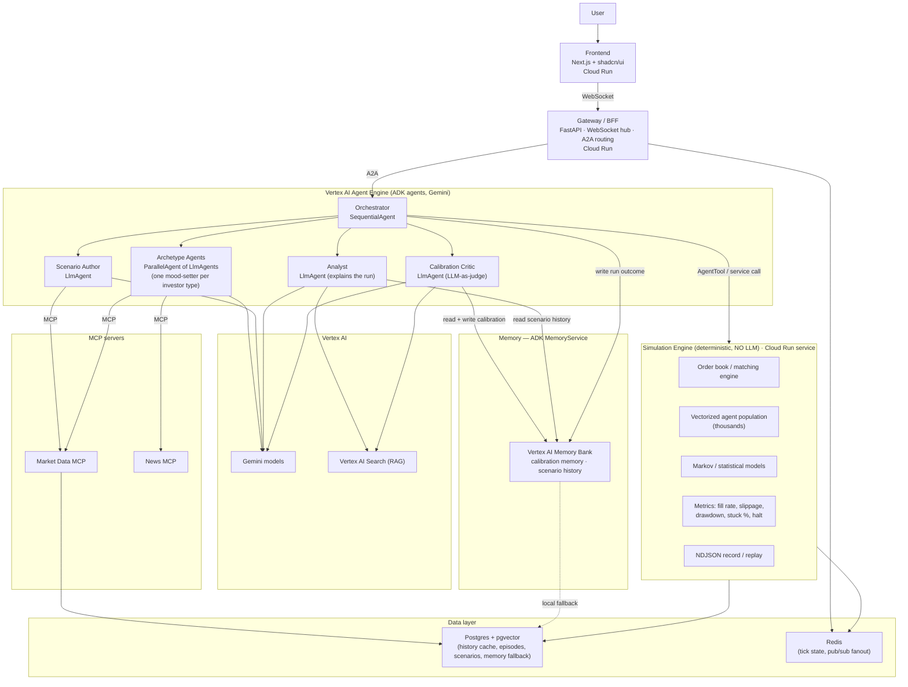

# Egress — Architecture and Build Document

This is the build specification for Egress, our entry to the Google for Startups AI Agents Challenge (Track 1, Build). It is written to be handed directly to Claude Code and Codex. Read this whole document before writing code. The repo and package name is `egress`; the product name is Egress AI.

---

## 1. What we are building

Egress simulates how an investment firm's position would behave in a crisis, before the money is committed.

The user describes a position and a stress event in plain language. The system simulates the sell-off as a market of thousands of independent trading agents that each act on their own and react to each other. Their orders meet in an order book that sets the prices, so the price moves come out of the agents' collective behaviour rather than being assumed. The user sees whether the position can actually be sold, how far the price moves while selling, and how much stays stuck, and can vary how much is held and how fast it is sold to find the point where the exit closes.

The problem this solves: firms routinely measure how much they could lose on a position, but not whether they could actually sell it in a crisis. Many firms unknowingly hold the same crowded trades, and when a shock hits and they all sell at once there are not enough buyers, the price collapses, and they cannot get out without heavy losses. There is no easy way today to test how a position behaves in that moment before committing.

### The single most important design principle

The language model is one part of the system, not the engine. The market mechanics (the order book, price formation, the tick loop, the metrics) are deterministic code. Most of the thousands of agents are cheap deterministic agents. A small number of Gemini agents set the behavioural mood for each investor type and explain what happened. If you removed every LLM call, the deterministic engine would still run a full simulation. This is both a hard requirement for scaling to thousands of agents and the thing that scores well on the technical criteria. Do not put a Gemini call in the inner per-agent per-tick loop.

---

## 2. Competition constraints this build must satisfy

These are mandatory. The build is invalid if it misses any of them.

- Intelligence: Gemini models, accessed through Vertex AI on the Gemini Enterprise Agent Platform.
- Orchestration: Google Agent Development Kit (ADK), Python.
- Infrastructure: deployed on Google Cloud. Agents go to Vertex AI Agent Engine (Agent Runtime). Web services (gateway, frontend, simulation service) go to Cloud Run. Local-only does not satisfy the rules.
- MCP: agents connect to external tools and data through the Model Context Protocol. This is central to Track 1.
- Grounding and RAG: use Vertex AI Search over a small corpus of historical crisis episodes and market microstructure references to ground the explanation and calibration agents.
- New project only, original work, built during the contest period.
- Third-party data and SDKs must be ones we are authorised to use, and must be declared in the submission.
- Testing: the deployed system must be reachable by judges for free during judging. Provide a public URL and credentials if anything is private.

A2A note: A2A is only mandatory for Track 3. We are Track 1, so A2A is optional. We include it because it is cheap here and lifts the technical and innovation scores: the Gemini archetype agents and the orchestrator communicate over A2A and are discoverable via agent cards. Keep it, but it is the first thing to cut if the timeline is at risk.

### Scoring criteria, and how the architecture targets each

- Technical Implementation (30 percent): clean code, well documented, deep use of ADK core concepts (agents, sessions, state, runners, the workflow agents SequentialAgent, LoopAgent, ParallelAgent, the generator-critic loop, AgentTool), MCP tool integration, and a real Google Cloud deployment. The deterministic-engine-plus-LLM split shows engineering judgement about where the model belongs.
- Business Case (30 percent): the problem section above. Crowded-exit risk is one of the most damaging and well-documented failure modes in markets. The output is a concrete decision aid.
- Innovation and Creativity (20 percent): a heterogeneous LLM-and-deterministic agent crowd that simulates an unwind, with a plain-language explanation of why the exit closed, and a calibration step against a real historical episode. The wedge over existing crowding analytics (which are static scores) is that we simulate the unwind as it happens.
- Demo and Presentation (20 percent): a clear problem, a vivid demo of a cascade unfolding with the order book draining, a plain-language explanation, an architecture diagram, and documentation of how ADK and the tools were used. Cached replay guarantees the demo runs cleanly.

---

## 3. System architecture



### Component summary

- Frontend (Cloud Run): Next.js app with shadcn/ui. Scenario builder, live and replay visualisation of the order book draining and the cascade, metrics dashboard, the plain-language explanation, and the levers to vary position size, exit speed, and crowding mix. A cached-versus-live toggle.
- Gateway / BFF (Cloud Run): FastAPI. A WebSocket hub that streams tick telemetry to the frontend, and an A2A client that routes requests to the ADK orchestrator. Batches tick broadcasts so thousands of updates do not overwhelm the socket (the thundering-herd lesson from race-condition).
- ADK agents (Agent Engine): the orchestrator and the Gemini agents. These supply judgement, not market mechanics. Detailed in section 4.
- Simulation engine (Cloud Run service, deterministic, no LLM): the order book, the agent population, the statistical models, the metrics, and the NDJSON record/replay. Detailed in section 5.
- MCP servers: market data and news tools the agents call. Section 6.
- Vertex AI: Gemini for the agents, Vertex AI Search for RAG grounding. Section 7.
- Memory (ADK MemoryService, Vertex AI Memory Bank): long-term memory across runs. Holds the critic's learned calibration adjustments and each user's scenario history. Detailed in section 7A.
- Data layer: Postgres with pgvector for the history cache, the episode corpus and its embeddings, saved scenarios, and the local memory fallback; Redis for tick state and pub/sub fanout.

---

## 4. The agent design (ADK)

The agents are organised in three tiers. This is how we get thousands of agents without thousands of LLM calls.

### Tier A — Gemini archetype agents (few, the judgement layer)

One Gemini-powered ADK `LlmAgent` per investor type. These do not run per individual agent. Each reads the scenario, the latest news for the instrument and period (over MCP), and the current market state, and outputs a structured behavioural stance for its whole type, for example an aggressiveness level and an adjusted sell threshold. The stance is written to `session.state` via `output_key`. The stance is refreshed every k ticks, not every tick, to control cost.

Investor types (each is an archetype agent plus a deterministic population that follows its stance):

- Forced sellers, who must sell because they hit a risk limit, face withdrawals, or get a margin call.
- Panic sellers, who sell into fear as bad news and falling prices build.
- Trend followers, who sell because the price is already falling and speed up the move.
- Bargain hunters, who buy once the price has dropped far enough to look cheap.
- Market makers, who trade both sides when calm but pull back under stress.
- Long-term holders, who mostly sit still.

The archetype agents run as a `ParallelAgent` (fan-out), each writing to a distinct `output_key` to avoid state races. This is Google's documented parallel fan-out pattern.

### Tier B — Deterministic population agents (thousands, the bodies)

Each individual investor is a lightweight deterministic agent with its own holdings, limits, and triggers, parameterised by its type's current stance from Tier A. These run inside the simulation engine, vectorised, with no LLM calls. They convert the archetype stance into concrete orders. Staggered parameters across the population are what turn one early seller into a cascade: one breaks, the price moves into the next one's limit, and so on.

### Tier C — Deterministic market mechanics (no LLM)

The order book, price formation, the tick loop, and the metrics. Pure code. Section 5.

### The orchestration agents (ADK)

- Scenario Author (`LlmAgent`, coordinator role): turns the user's plain-language position and stress event into a structured, validated scenario config (instrument, position size, exit speed, crowding mix, shock schedule). Grounds on the market data MCP to resolve the instrument and its reference data. Output is validated deterministically against a schema before the run starts.
- Orchestrator (`SequentialAgent`): the run lifecycle. Setup, then the simulate loop, then analyse. Wraps the simulation engine as an `AgentTool` or calls it as a service.
- Simulate loop (`LoopAgent`, up to N ticks): advances the deterministic engine, and every k ticks re-invokes the archetype agents to refresh stances based on the new market state and any new news.
- Analyst (`LlmAgent`): reads the deterministic event log after the run and writes the plain-language narrative of how the exit unfolded. Grounded in the sim log and in Vertex AI Search. The simulation is the source of truth; the model interprets, it does not invent the dynamics.
- Calibration Critic (`LlmAgent`, generator-critic / LLM-as-judge): compares the simulated unwind to a replayed real historical episode and flags where the simulated crowd behaved implausibly, for example too calmly. This is the quality gate that addresses the known tendency of LLM-driven market agents to behave too rationally. Implemented with a `LoopAgent` that can adjust archetype parameters and re-run, with a max iteration cap.

ADK patterns used, explicitly: sequential pipeline (lifecycle), loop (tick engine, stance refresh, calibration), parallel fan-out (archetype agents), coordinator (scenario author), generator-critic (calibration), hierarchical via AgentTool (engine wrapped as a tool), and optional human-in-the-loop (the user varies and re-runs scenarios). State is passed through `session.state` with descriptive `output_key`s. Use the ADK `Runner` to execute and ADK sessions for state.

### Pseudocode sketch (ADK, illustrative)

```python
# Archetype mood-setter, one per investor type
forced_seller_mood = LlmAgent(
    name="ForcedSellerMood",
    model="gemini-2.5-flash",
    instruction=(
        "You set the behaviour of forced sellers given the scenario, the latest "
        "news, and the current market state. Output a JSON stance: "
        "{aggressiveness: 0..1, sell_threshold_pct: float}. Be concrete."
    ),
    tools=[news_mcp_tool, market_data_mcp_tool],
    output_key="forced_seller_stance",
)
# ...one per type...

archetypes = ParallelAgent(
    name="Archetypes",
    sub_agents=[forced_seller_mood, panic_mood, trend_mood,
                bargain_mood, market_maker_mood, holder_mood],
)

simulate_loop = LoopAgent(
    name="SimulateLoop",
    max_iterations=MAX_TICK_WINDOWS,
    sub_agents=[archetypes, advance_engine_agent],  # engine advance is deterministic
)

orchestrator = SequentialAgent(
    name="EgressRun",
    sub_agents=[scenario_author, setup_agent, simulate_loop, analyst, critic],
)
```

The engine advance step inside the loop is a deterministic tool call, not an LLM agent. It runs k ticks of the order book and population in the engine service and returns the new state to `session.state`.

---

## 5. The simulation engine (deterministic core, no LLM)

This is the heart of the system and it contains no LLM calls. Build it so it can run thousands of agents per tick cheaply, vectorised with NumPy.

- Order book: a price-time priority limit order book. Submit, cancel, match. Produces fills, last price, best bid and offer, and depth at each level.
- Tick loop: each tick, every population agent decides an action based on the current market state and its type's current stance, orders are submitted, the book matches, price and liquidity update, and metrics are recorded. Up to N ticks per run.
- Population: each agent has type, holdings, a risk limit, a trigger, and a starting position in the crowded trade. Generated from the scenario's crowding mix with staggered parameters.
- Statistical / Markov agents: for the types whose micro-behaviour is statistical, fit a transition model to the real historical returns of the instrument (pulled via the market data MCP) and sample the next-move intention. This is what makes those agents grounded rather than invented.
- Halt constraint: model the single-stock volatility halt as a known, fixed rule. If the price moves past the band in a short window, trading pauses. A position caught on the wrong side of a halt is one concrete way the exit closes. This is a constraint the engine enforces, not something the user tunes.
- Metrics: fill rate (how much of the position sold), implementation shortfall and slippage (how far the price moved while selling), max drawdown, time to exit, percentage left stuck, and whether a halt triggered.
- Record and replay: write each run as an NDJSON stream of tick events. The frontend can replay it exactly, with no live LLM or engine calls. This is the demo reliability mechanism and the deterministic baseline, copied from race-condition.

Provide a deterministic baseline mode where the archetype stances come from a fixed heuristic instead of Gemini, so the whole system can run with zero LLM calls for load testing, cost-free development, and as the proof that the model is one part of the system.

---

## 6. MCP servers

Build two MCP servers. Agents call them as tools. This satisfies the Track 1 MCP requirement and keeps data access clean and swappable.

- Market Data MCP. Tools: `get_historical_window(instrument, start, end)`, `get_instrument_reference(instrument)` returning average daily volume, free float, and halt tier, and `get_liquidity_profile(instrument)`. Backed by a market data API and cached in Postgres. Used by the scenario author (to resolve and validate the instrument) and by the engine's statistical fitting.
- News MCP. Tools: `get_event_news(instrument, period)` and `get_sentiment(text)`. Backed by a news source. Used by the archetype agents to read the scenario's news and set their mood.

Use real, authorised data sources. Historical data is sufficient for the build; live real-time feeds are a later upgrade, not a day-one requirement, and we will say so honestly in the submission. Declare every data source and API in the submission's data sources and third-party fields.

---

## 7. Grounding and RAG

Build a small Vertex AI Search corpus of historical crisis episodes and short market-microstructure references. The analyst agent uses it to ground its explanation of the unwind, and the calibration critic uses it to compare the simulated run against how a real episode actually behaved. Keep the corpus small and curated; this is grounding for credibility, not a large knowledge base.

---

## 7A. Memory across runs (long-term)

Grounding and RAG above are read-only reference. This section is different: it is memory the system writes and reads as it is used, so the product improves and remembers across separate runs. Implement it with the ADK `MemoryService` backed by Vertex AI Memory Bank, with pgvector as the local fallback when running without the cloud. Do not confuse this with `session.state`, which is short-term memory inside a single run.

Two distinct uses, both genuine, not decorative:

- Calibration memory. The calibration critic learns how to adjust the crowd so it stops behaving too rationally when checked against a real historical episode. Those learned adjustments (which archetype parameters were nudged, and in which direction, for which kind of scenario) are written to memory and read back at the start of later runs. The simulated crowd then gets better calibrated over time instead of relearning from scratch every run. This serves the hardest problem in the system, behavioural fidelity, and is the more important of the two.
- Scenario history. Each run's scenario and outcome is written to memory per user. The analyst reads it so it can compare across runs, for example noting that the current position is more fragile than one the user tested earlier, and the frontend can list and reopen past simulations.

Where it sits: the critic reads and writes calibration memory, the orchestrator writes the run outcome at the end of a run, and the analyst reads scenario history when composing its explanation. Memory Bank is the store; pgvector holds the same records locally as a fallback.

Honest scope: long-term memory is a stretch item for a 2 to 3 hour window. The thin slice runs without it. But build at least a minimal version, because it is the difference between a comprehensive multi-agent system and a clever pipeline, and it is the platform capability (Agent Memory Bank) that a judge will look for. If time forces a cut, implement scenario history (simpler) and stub calibration memory behind the same interface.

---

## 8. Frontend (Next.js + shadcn/ui, Cloud Run)

- Scenario builder: plain-language description of the position and the stress event, plus controls for position size, exit speed, and crowding mix. shadcn form components.
- Visualisation: the price path over the run, the order book depth draining as the crowd sells, fill progress against the target, and a clear marker when a halt triggers. This is the demo centrepiece, so make the cascade legible.
- Metrics panel: fill rate, slippage, drawdown, percentage stuck, time to exit.
- Explanation panel: the analyst agent's plain-language narrative of why the exit closed.
- Levers panel: change size, exit speed, and crowding mix, and re-run.
- Cached versus live toggle: boots in cached replay mode for a reliable demo, with a live mode that runs the agents for real.

Before building any UI, the coding agent should read `/mnt/skills/public/frontend-design/SKILL.md` for the design tokens and styling constraints in this environment, and follow it. Keep the look restrained and intentional, not a default template.

---

## 9. Repository structure

Mirror the discipline of Google's race-condition repo: a real Makefile, a multi-stage Dockerfile, a docker-compose that mirrors the cloud topology locally, a docs subtree, offline-runnable tests, CI, an eval target, Terraform that scales to zero, and the cached-replay and deterministic-baseline variants.

```
egress/
├── agents/                  # ADK agents (Python, Gemini)
│   ├── scenario_author/
│   ├── archetypes/          # one mood-setter LlmAgent per investor type
│   ├── analyst/
│   ├── critic/
│   └── common/              # session/state helpers, runner setup, schemas
├── engine/                  # deterministic simulation core (NO LLM)
│   ├── orderbook/
│   ├── population/          # vectorized agents
│   ├── stats/               # markov/statistical fitting
│   ├── metrics/
│   └── replay/              # NDJSON record/replay
├── mcp/
│   ├── market_data/
│   └── news/
├── memory/                  # ADK MemoryService wiring: calibration memory + scenario history
├── gateway/                 # FastAPI WebSocket hub + A2A routing
├── web/                     # Next.js + shadcn frontend
├── infra/                   # Terraform (Agent Engine, Cloud Run, Cloud SQL, Redis)
├── docs/                    # architecture, design decisions, protocols
├── eval/                    # agent evals, backtest vs a real episode
├── scripts/                 # deploy.sh, seed_data.py
├── tests/                   # offline-runnable (mock google.auth in conftest.py)
├── Makefile
├── Dockerfile
├── docker-compose.yml       # postgres, redis, mock data
├── pyproject.toml
├── AGENTS.md                # entry instructions for AI coding tools
├── CLAUDE.md                # Claude Code specific notes
├── README.md
├── SECURITY.md
├── LICENSE                  # Apache 2.0
└── .env.example
```

Makefile targets to provide, matching race-condition: `init`, `start`, `stop`, `restart`, `test`, `lint`, `fmt`, `build`, `eval`, `deploy`, `check-prereqs`.

---

## 10. Technology stack and deployment

- Language: Python 3.13 for agents, engine, gateway, MCP. TypeScript for the frontend.
- Orchestration: ADK (Python).
- Models: Gemini via Vertex AI. Use a fast Gemini model for the archetype mood-setters (they run repeatedly) and a stronger Gemini model for the analyst and critic.
- RAG: Vertex AI Search.
- Memory: ADK MemoryService backed by Vertex AI Memory Bank, with pgvector as the local fallback. Holds calibration memory and scenario history across runs (section 7A).
- Agents deploy to: Vertex AI Agent Engine (Agent Runtime).
- Web services deploy to: Cloud Run (frontend, gateway, engine service, MCP servers).
- Data: Cloud SQL Postgres with pgvector, Memorystore Redis.
- Infra: Terraform, scales to zero by default to protect the $500 credit.
- Local dev: docker-compose for Postgres, Redis, and mock data, so the system runs on a laptop with the deterministic baseline and no cloud cost.

Cost discipline for the $500 credit: develop against the deterministic baseline and cached replay so most work costs nothing. Only the live agent runs and the calibration backtest consume Gemini credits. Scale all Cloud Run services and the agents to zero between runs.

---

## 11. Build plan

Phased so that there is a working, demonstrable vertical slice as early as possible, and the scoring essentials are in before the nice-to-haves. Given the time pressure, follow this order strictly.

- Phase 0 — Scaffold. Repo structure, Makefile, docker-compose, pyproject, .env.example, CI skeleton, AGENTS.md and CLAUDE.md. Apache 2.0 license.
- Phase 1 — Deterministic engine MVP. Order book, one instrument, the six agent types as deterministic agents driven by fixed stances, the metrics, and NDJSON record. No LLM. This alone produces a runnable cascade and is the backbone of the demo.
- Phase 2 — ADK orchestration. Scenario author, the six archetype mood-setters as a ParallelAgent, the simulate LoopAgent wiring the archetypes to the engine, and the analyst. The two MCP servers. Sessions, state, runner.
- Phase 3 — Frontend. Next.js plus shadcn. Scenario builder, the cascade and order-book visualisation, the metrics and explanation panels, the levers, and the cached-versus-live toggle. The FastAPI gateway with WebSocket streaming.
- Phase 4 — Calibration and backtest. The critic agent and a backtest against one real historical episode. This is the credibility and most of the findings section.
- Phase 4A — Memory. Wire the ADK MemoryService and Vertex AI Memory Bank. Write scenario history on each run and read it in the analyst; persist the critic's calibration adjustments and read them at run start. Scenario history first, calibration memory second (section 7A).
- Phase 5 — Deploy to Google Cloud. Agents to Agent Engine, services to Cloud Run, Cloud SQL and Redis, Terraform. Record a cached replay of the flagship scenario for the demo.
- Phase 6 — Docs, diagram, eval, demo video, and the submission write-up fields.

If time runs short, the minimum viable submission that still scores is: Phases 0, 1, 2, 3 and a deployed Cloud Run plus Agent Engine instance, with one scripted scenario shown via cached replay, plus the architecture diagram and clean docs. The calibration backtest (Phase 4), full memory (Phase 4A), and A2A are the first cuts, though a minimal scenario-history memory is cheap and worth keeping. Do not cut the deployment, the MCP servers, or the deterministic-versus-LLM split, because those are what the rules and the technical score require.

### Splitting work between Claude Code and Codex

Run them in separate worktrees or project folders to avoid collisions. A clean split:

- Codex: the deterministic engine (Phase 1), the frontend (Phase 3), and the Terraform and deploy scripts (Phase 5). These are well-specified, self-contained, and testable.
- Claude Code: the ADK agents and orchestration (Phase 2), the MCP servers, the memory wiring (Phase 4A), the calibration and eval (Phase 4), and the docs. These need judgement about ADK patterns and prompts.

Both read AGENTS.md on entry. Keep a shared `docs/contracts.md` defining the engine's input and output schema and the session.state keys, so the two halves meet cleanly at the boundary.

---

## 12. Honest scope notes

- Behavioural fidelity is the hard part and we will not fully solve it in the time. We demonstrate plausibility on one replayed historical episode via the calibration critic and we are transparent about the gap. This is a genuine finding for the findings field, not a weakness to hide.
- Thousands of agents is real, but only because most agents are deterministic and cheap. Keep the Gemini calls at the archetype and explanation level. A Gemini call in the per-agent per-tick loop will break both the cost and the latency.
- The single-stock halt is a fixed, known constraint inside the simulation, not something the user tunes. It is one way the exit closes, not a separate feature.
- Real-time data is a later upgrade. The build uses historical data, which is honest and sufficient.

---

## 13. First steps for the coding agents

1. Read this whole document and `/mnt/skills/public/frontend-design/SKILL.md` before writing code.
2. Create the repo structure in section 9 and the Phase 0 scaffold.
3. Write `docs/contracts.md` defining the engine input and output schema and the session.state keys, so both coding agents build to the same boundary.
4. Build Phase 1, the deterministic engine, and prove a cascade runs end to end with a recorded NDJSON stream and printed metrics, before any agent or cloud work.
5. Only then wire the ADK agents in Phase 2.

Set up Google Cloud early in parallel: create the project, request the $500 credit, enable Vertex AI, Agent Engine, Cloud Run, Cloud SQL, and Vertex AI Search, and write Application Default Credentials. The agents read the project from `.env`, not from gcloud config.
