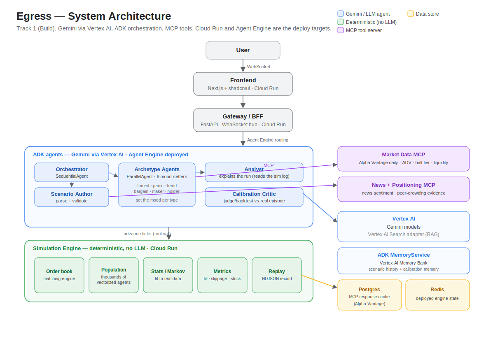
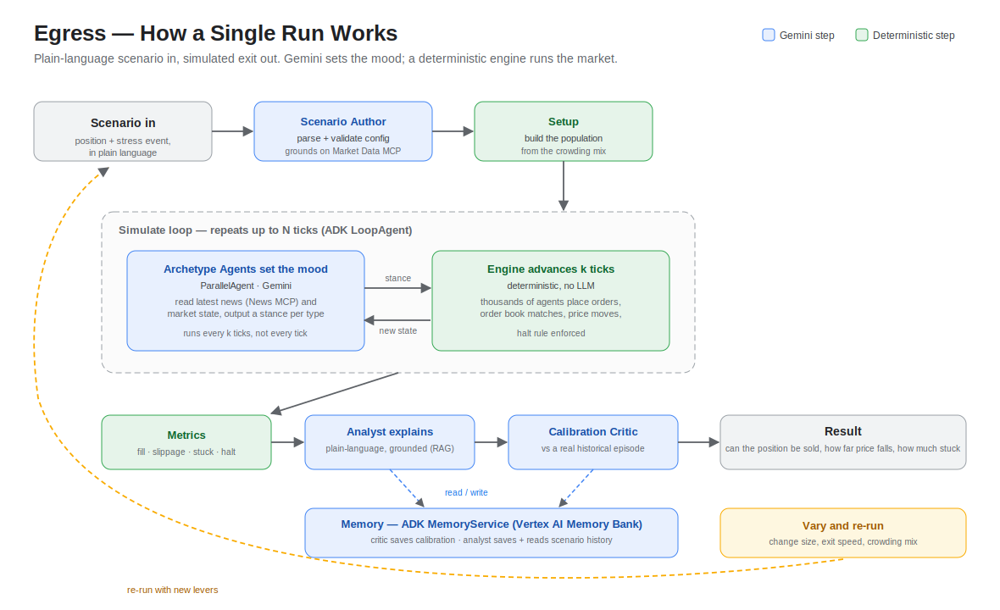

# Egress AI

Egress simulates how an investment position would behave in a crisis sell-off, before the money is committed.

> Entry to the Google for Startups AI Agents Challenge (Track 1, Build).

## Live demo

**<https://egress-frontend-978090004115.us-central1.run.app>**

Cached mode replays a **recorded** CVNA cascade instantly, with no market-data or
Gemini calls. A live run re-runs the deterministic ensemble; ticking *Use real
Gemini (Vertex AI)* uses Gemini once up front to build scenario assumptions, then
runs the deterministic low/base/high ensemble with timeout fallback.

> The hosted URL runs the current deployed build. The instrument picker, live
> Alpha Vantage daily-data path, Agent Engine route, and deployed Cloud Run
> services are active there; free-tier provider throttling can still cause a
> clearly labelled synthetic fallback for a given check.

## Demo video

[](https://youtu.be/8xlknY_OmvI)

Watch the walkthrough: <https://youtu.be/8xlknY_OmvI>

## Problem and solution

Firms routinely measure how much they could lose on a position, but not whether they could actually *sell* it in a crisis. Many firms unknowingly hold the same crowded trades, and when a shock hits and they all sell at once there are not enough buyers, the price collapses, and they cannot get out without heavy losses. There is no easy way today to test how a position behaves in that moment before committing.

Egress lets you stress-test it. You describe a position and a stress event in plain language. The system simulates the sell-off as a market of thousands of independent trading agents that each act on their own and react to each other. Their orders meet in a stylized persistent limit order book, so the price moves while selling come out of the agents' collective behaviour rather than from an assumed price-impact curve (the scenario's exogenous shocks aside). You see whether the position clears under the stated assumptions, how far the simulated price moves while selling, and how much stays stuck, and you can vary how much is held and how fast it is sold to find the point where the exit closes.

## Three-tier architecture

The defining design choice is that the language model is one part of the system, not the engine. Egress runs in three tiers:

1. **Gemini/ADK sets assumptions, not mechanics.** In the default deployed live path, a Gemini Scenario Author runs once through Vertex AI / Agent Engine to build the scenario assumptions and crowd read, then Egress runs the deterministic low/base/high ensemble. The slower detailed path can still run six Gemini `LlmAgent`s as an ADK `ParallelAgent`, one per investor type, to refresh archetype stances once per window. No Gemini call sits inside the per-agent or per-tick loop.
2. **A deterministic NumPy population acts on those assumptions.** Thousands of lightweight agents live as rows in NumPy arrays, parameterised by the scenario, peer-crowding profile, and the active stance set. Staggered per-agent thresholds decide who sells and when, which is what produces a cascade rather than a single synchronised dump.
3. **An order-book engine matches the orders.** A stylized price-time-priority limit order book (`engine/orderbook/book.py`) matches each tick: a sell sweeps the highest resting bids first and fills at the bid price until the order is exhausted. Resting orders persist across ticks, age, cancel as they go stale, and replenish more slowly as stress rises. Fill rate, slippage, stuck percentage and drawdown are computed from the **matched quantities and traded prices** — not a price-impact formula — and a single-stock volatility halt is a fixed band rule. Each run is recorded to an NDJSON replay stream. Honest caveat: this is still a simulated book built from agents, not observed Level 2 depth; the price is the last traded level **plus an exogenous shock gap** the scenario applies at scheduled ticks.

The app reports **impact estimates**, not exact causal attribution. Every run
includes heuristic same-run estimates for scheduled shocks, trading impact, and
liquidity withdrawal; representative paths can also include paired
counterfactual deltas that rerun the scenario without peer cohorts, without
exogenous shocks, and without the exit trader. Those deltas are useful
diagnostics, but still approximate stress-model evidence rather than proof of
what caused a real market move.

**What the model does — and doesn't.** In the app's default live Gemini mode, Gemini builds the scenario assumptions once — the crisis schedule and crowd mood read — and Egress then runs the deterministic low/base/high ensemble without per-window model calls. The slower detailed ADK path can still have each archetype agent set three scalars for its investor type — aggressiveness, sell-threshold, participation — clamped to the contract's `Stance` ranges before the engine reads them. Either way, the model tunes assumptions and explanation; it does not add any market mechanic the deterministic baseline lacks. Remove every Gemini call and the engine still produces a full simulation — the baseline mode the test suite and offline demos run on.

### System architecture



### How a single run works



The diagrams show the current deployed path. The hosted build uses Cloud Run for
the frontend, gateway, deterministic engine service, and MCP services; the
gateway routes live Gemini runs through the deployed Agent Engine resource.
Agent cards provide A2A-style discovery metadata, but full A2A transport is not
required for Track 1 and is not the critical runtime dependency.

Redis is used by the deployed engine/run-state path, while the gateway streams
WebSocket frames directly to the browser. RAG retrieval uses a local corpus path
with a Vertex AI Search adapter for the deployed datastore. Long-term memory
uses ADK's `VertexAiMemoryBankService` when an Agent Engine id is configured.
Local development still has deterministic/offline safeguards so tests can run
without cloud credentials.

### Calibration against a real episode

The system's hardest problem is behavioural fidelity: model-driven market agents tend to behave too rationally — selling too orderly, support that does not evaporate. The **calibration critic** is the quality gate for that. After a run it compares the simulated unwind to a curated real crisis episode (Carvana's late-2022 collapse, a ~75% peak-to-trough drawdown) on three timescale-fair axes — how far the price was forced, how much of the position was stranded, and whether the move was disorderly enough to halt — and judges the crowd *plausible* or *too calm*. When too calm, it emits bounded per-type stance nudges, and a generator-critic loop re-runs until the crowd reproduces the episode's behavioural signature.

```bash
make eval          # the calibration backtest: starts an over-rational crowd and
                   # calibrates it to the real CVNA episode (offline, no LLM, no cloud)
make eval-discrimination-full  # 12-case calibration + holdout discrimination report
make eval-holdout              # holdout-only falsification report
make eval-latency              # deterministic engine latency report
```

The critic has a deterministic stand-in (the verdict and nudges are exact, not a model guess) and a live Gemini judge that writes the same verdict as a narrative (`python -m agents.orchestrator --critic`, add `--live` for Vertex). The backtest runs entirely on the deterministic baseline, so it is reproducible and free.

Validation expands beyond the flagship case. The full discrimination eval
loads the committed public-case corpus in [`eval/episodes`](./eval/episodes), keeps
calibration and holdout reports separate, and replays recorded Gemini assumption
fixtures to show whether Gemini improves or worsens the same deterministic runs.
Details are in [`docs/evaluation.md`](./docs/evaluation.md).

## Running it yourself

Everything in steps 1 and 2 runs fully offline with no cloud account and no API keys. Step 3 is optional and adds real data and real Gemini.

### Prerequisites

- **Python 3.13** and **pip**
- **Node.js 18+** and **npm** (only for the frontend in step 2)
- **Docker** with `docker compose` (only if you want to cache API responses or run the local data layer)
- **gcloud** (only for the live Gemini path in step 3)

### Setup

```bash
git clone https://github.com/edgycapitalist/egress.git
cd egress
make init     # installs the package (all extras + dev) and creates .env from .env.example
make test     # offline test suite: no network, no credentials. Confirms the install works.
```

### 1. Offline simulation (no cloud, no keys)

```bash
make demo          # deterministic engine on the flagship CVNA scenario
make demo-agents   # the full ADK orchestration in baseline mode, end to end with zero LLM calls
```

`make demo` runs the crowded CVNA position through a downgrade shock and prints the metrics (fill rate, slippage, stuck percentage, halts), then writes an NDJSON replay under `runs/`. `make demo-agents` drives the whole ADK lifecycle (setup, the simulate `LoopAgent`, finalize, and the analyst) through the real ADK `Runner` with the archetype and analyst models swapped for deterministic stand-ins, so it produces a cascade, metrics, a replay, and a plain-language narrative without a single Gemini call.

### 2. The app locally (gateway + frontend)

Run the two services in separate terminals:

```bash
# terminal 1: the gateway (FastAPI + WebSocket hub) on http://127.0.0.1:8000
make gateway

# terminal 2: the frontend (Next.js) on http://localhost:3000
make web-install   # first time only
make web
```

Open <http://localhost:3000>. The frontend defaults to the gateway at `ws://127.0.0.1:8000/ws/run` (override with `NEXT_PUBLIC_GATEWAY_WS`; see [`web/.env.example`](./web/.env.example)). The UI boots in **cached** mode, which **replays a committed recording** of the selected instrument (the flagship CVNA cascade by default) — fully offline and identical every time. Cached ignores the other levers because it is a recording; switch to **Live** to re-run the engine, where the position size, exit speed, crowding mix, and the chosen instrument actually drive a fresh simulation.

### 3. Real data and live Gemini (optional)

**Real market data.** Get a free Alpha Vantage key at <https://www.alphavantage.co/support/#api-key> and set `ALPHAVANTAGE_API_KEY` in `.env`. A **live** run then resolves the chosen instrument's recent daily data, caching responses in Postgres (`make start` brings up Postgres and Redis locally). The free tier serves ~100 trading days of daily bars, so a live run uses the name's **current** conditions, not a historical crisis window (see [Data sources](#data-sources)). Without a key, the servers fall back to a deterministic synthetic feed automatically.

**Live Gemini through Vertex AI.**

```bash
gcloud auth application-default login
# in .env: set GOOGLE_CLOUD_PROJECT and GOOGLE_CLOUD_LOCATION (GOOGLE_GENAI_USE_VERTEXAI=true is the default)
make auth-check    # makes one real Gemini call to confirm auth and quota
make demo-live     # the detailed ADK pipeline against real Gemini via Vertex AI
```

To run the app's **live** toggle against Gemini, start the gateway with `EGRESS_LIVE_GEMINI=true make gateway`; otherwise a live run in the UI uses deterministic assumptions. The gateway defaults to `EGRESS_GEMINI_LIVE_MODE=fast`: Gemini builds assumptions once, then the deterministic ensemble runs. Set `EGRESS_GEMINI_LIVE_MODE=detailed` only when you want the slower per-window archetype refresh path. If assumption generation exceeds `EGRESS_GEMINI_TIMEOUT_SECONDS`, the gateway falls back to deterministic assumptions and still returns a usable ensemble. Gemini is reached only through Vertex AI with Application Default Credentials; an AI Studio `GOOGLE_API_KEY` is never used. The full configuration is documented in [`.env.example`](./.env.example).

## Tech stack

| Layer | Tech |
| --- | --- |
| Simulation engine | Python 3.13, NumPy, Pydantic. No LLM, no cloud. |
| Agent orchestration | Google ADK (`SequentialAgent`, `ParallelAgent`, `LoopAgent`), Gemini via Vertex AI. |
| External data | Three MCP servers over the Model Context Protocol — Alpha Vantage **daily bars** (market data), Alpha Vantage **news headlines**, and free **positioning evidence** (user CSV, opt-in SEC EDGAR, curated fixtures, synthetic fallback). Daily only; no intraday or order-book/Level 2 feed. |
| Gateway / BFF | FastAPI, WebSocket streaming of tick telemetry. |
| Frontend | Next.js 15, React 19, shadcn/ui, Tailwind CSS. |
| Local data layer | Postgres and Redis via docker-compose. Postgres backs an optional cache for fetched market data and the memory fallback; Redis backs deployed engine run state, with an in-memory local fallback for tests. |

See [`AGENTS.md`](./AGENTS.md) for the full build specification and [`docs/contracts.md`](./docs/contracts.md) for the engine and agents boundary.

## Data sources

The market-data MCP server calls one Alpha Vantage endpoint — `TIME_SERIES_DAILY` with `outputsize=compact` — when `ALPHAVANTAGE_API_KEY` is set. From those daily bars it derives three real numbers: the **reference price**, the **average daily volume** (mean of recent volume), and the **daily realized volatility** (standard deviation of daily returns). Real calls are budgeted for the free tier — at most a few per run and `25`/day by default, throttled, with a short provider cooldown and immediate synthetic fallback when a limit is hit — so a temporary provider/account throttle does not poison the warm process for every later ticker.

The positioning MCP server adds free peer-crowding inputs. It uses this precedence:
**user-uploaded holdings CSV** first, then opt-in **SEC EDGAR** public JSON lookups
(`EGRESS_ENABLE_SEC_EDGAR=true` plus a descriptive `SEC_USER_AGENT`), then curated
historical episode fixtures, then deterministic synthetic assumptions. SEC calls do
not require an API key; they are cached in Postgres and throttled below SEC's
published fair-access ceiling. The v1 SEC path is conservative: it records issuer
identity / available holder rows when present, but it does not claim a paid-grade
all-holder aggregation feed.

What is **not** real data, stated plainly:

- **Free float is a proxy, not a feed.** It is not on the free tier, so the server estimates it as `adv × 30` (`mcp/market_data/data.py`). Treat it as a rough scale, not a real figure.
- **The behavioral crowd composition and the position size are user-set.** The six-type `crowding_mix` and the position size come from the UI sliders / scenario. The separate `peer_crowding` profile can now come from user CSV, SEC/public evidence when available, curated fixtures, or synthetic assumptions, and the run labels which source was used.
- **There is no paid holder, short-interest, prime-broker, securities-lending, or Level 2 positioning feed.** SEC EDGAR is free public data and useful for evidence labels and any rows the parser can read; when it cannot produce a holder profile, the system falls back to curated or assumption-led peer-crowding cases and says so.
- **There is no order-book / Level 2 feed.** The persistent book's depth is built from the simulated agent population: each agent's quote size (`size_base`) and holdings scale with the instrument's real ADV (`liq_unit = adv / population_size`) and are capped by free float (`engine/population/population.py`). Real ADV sets the *scale* of depth; the depth itself is synthesized, not observed. Resting quotes age, cancel, and replenish through seeded engine rules rather than through a live exchange feed.
- **Free-tier history is ~100 days.** `outputsize=full` is premium, so historical crisis windows (CVNA late-2022, SVB March-2023) cannot be fetched. **Cached** mode therefore replays committed recordings of those episodes (a historical *reference*), while a **live** run uses the instrument's current ~100-day data and does **not** reproduce the historical crisis.

The news MCP server calls `NEWS_SENTIMENT` for real headlines, used by the live Gemini assumption/detailed archetype paths; it falls back to a deterministic synthetic crisis tape otherwise.

When no key is present, SEC is disabled, or a call is rate-limited/errors, every feed falls back to a **deterministic synthetic** version — seeded by the symbol — so `make test`, `make demo`, and `make demo-agents` run fully offline and reproducibly with no credentials.

## License

[Apache 2.0](./LICENSE).
